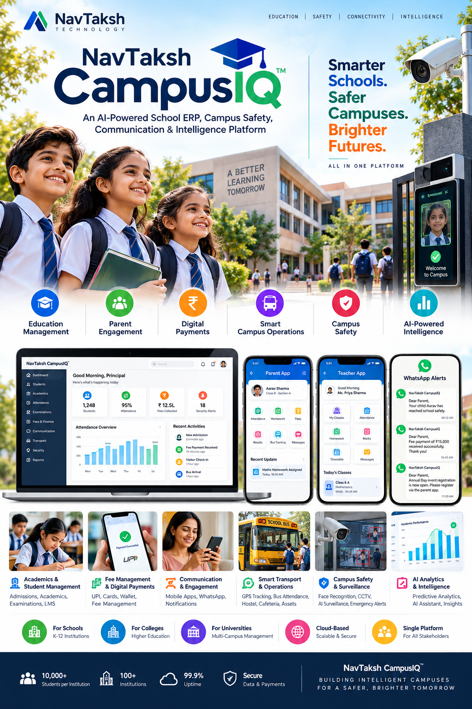

# NavTaksh-CampusIQ
NavTaksh CampusIQ™ – An AI-powered School ERP, Campus Safety, Communication, Digital Payments, Face Recognition Attendance, and Campus Intelligence Platform for modern educational institutions.

# NavTaksh CampusIQ™

> **An AI-Powered School ERP, Campus Safety, Communication & Intelligence Platform**



---

## Vision

**NavTaksh CampusIQ™** is a next-generation Smart Campus Platform designed to unify educational administration, student engagement, digital payments, AI-powered surveillance, and campus intelligence into a single ecosystem.

The platform is built to serve:

- Schools
- Colleges
- Universities
- Residential Campuses
- Hostels
- Educational Groups

---

# Why CampusIQ?

Traditional School ERP systems focus only on administration.

CampusIQ extends beyond ERP by integrating:

- Student Information System (SIS)
- Learning Management
- Parent Engagement
- Digital Payments
- Face Recognition Attendance
- AI Surveillance
- Visitor Management
- Smart Transport
- Communication Platform
- Analytics & AI Assistant

---

# Product Pillars

## 🎓 Education Management

- Admissions
- Student Lifecycle Management
- Academics
- Timetables
- Homework
- Examinations
- LMS Integration

---

## 👨‍👩‍👧 Parent Engagement

- Parent Mobile App
- Teacher Mobile App
- WhatsApp Notifications
- In-App Messaging
- Push Notifications
- Report Cards
- Homework Tracking

---

## 💳 Digital Payments

- UPI Payments
- Credit/Debit Cards
- Net Banking
- Wallet Support
- Fee Management
- Refund Processing
- Digital Receipts

Supported Gateways:

- Razorpay
- Cashfree
- PhonePe PG
- PayU

---

## 🛡️ Campus Safety

### Face Recognition Attendance

- School Entry
- Classroom Attendance
- Hostel Attendance
- Bus Attendance

### Visitor Management

- Visitor Registration
- Photo Capture
- ID Verification
- Approval Workflow

### AI Surveillance

- Intrusion Detection
- Loitering Detection
- Crowd Monitoring
- Weapon Detection
- Fight Detection
- Fall Detection

---

## 🚌 Smart Transport

- GPS Tracking
- Route Monitoring
- Driver Management
- Bus Attendance
- Boarding Notifications
- Parent Alerts

---

## 🏫 Smart Campus Operations

- Library Management
- Hostel Management
- Cafeteria Management
- Asset Tracking
- Inventory Management
- Event Management

---

## 🤖 AI Intelligence Layer

### Learning Analytics

- Attendance Trends
- Academic Performance
- Engagement Analysis

### Predictive Analytics

- Academic Risk Detection
- Dropout Prediction
- Fee Default Prediction

### AI Assistant

Parents can ask:

- What is my child's attendance?
- Show fee balance.
- Show homework.

Teachers can ask:

- Show students below 75% attendance.
- Show low-performing students.

Administrators can ask:

- Show fee collection trends.
- Show academic performance analytics.

---

# Major Modules

| Module | Description |
|----------|-------------|
| Student Management | Student lifecycle management |
| Academic Management | Classes, subjects, timetables |
| Attendance Management | Manual, QR, RFID, biometric, face recognition |
| Examination Management | Exams, grading, report cards |
| Fee Management | Fees, scholarships, payments |
| Parent Portal | Parent engagement |
| Teacher Portal | Teaching tools |
| Communication Platform | WhatsApp, SMS, Email |
| Transport Management | GPS & attendance |
| Library Management | Books & digital library |
| Hostel Management | Hostel operations |
| HR & Payroll | Staff management |
| Visitor Management | Visitor tracking |
| AI Surveillance | Security monitoring |
| Learning Analytics | Academic intelligence |

---

# Technology Stack

## Backend

- Python 3.13+
- Django 6+
- Django REST Framework

---

## Frontend

### Web

- Next.js
- React
- TypeScript
- Material UI

### Mobile

- Flutter
- Android
- iOS

---

## Database

- PostgreSQL 17+
- pgvector
- PostGIS

---

## Cache & Queue

- Redis
- Celery
- Celery Beat

---

## AI Platform

### AI Services

- FastAPI
- OpenAI Compatible APIs
- LangChain
- RAG Pipelines

### Face Recognition

- SCRFD
- AdaFace
- FAISS

### Computer Vision

- YOLOv12
- OpenCV

---

## Storage

- MinIO
- AWS S3

---

## Communication

### WhatsApp

- MSG91
- Gupshup
- Interakt
- Twilio

### SMS

- MSG91
- Textlocal

### Email

- Amazon SES

### Push Notifications

- Firebase Cloud Messaging (FCM)

---

## Payments

- Razorpay
- Cashfree
- PhonePe PG
- PayU

---

## Monitoring

- Prometheus
- Grafana
- Loki

---

## Deployment

- Docker
- Nginx
- Gunicorn
- Kubernetes (Future)

---

# System Architecture

```text
Clients
│
├── Web Portal
├── Parent App
├── Teacher App
├── Student App
│
API Layer
│
├── Django REST API
├── Authentication
├── Authorization
│
Core Services
│
├── Student Management
├── Academics
├── Attendance
├── Examinations
├── Finance
├── Communication
├── Transport
│
AI Services
│
├── RAG
├── AI Assistant
├── Analytics
├── Predictions
│
Surveillance Services
│
├── SCRFD
├── AdaFace
├── FAISS
├── YOLO
│
Data Layer
│
├── PostgreSQL
├── Redis
├── MinIO
└── Object Storage
```

---

# Product Roadmap

## Phase 1 – ERP Foundation

- Student Management
- Academics
- Attendance
- Examination
- Fee Management

---

## Phase 2 – Communication & Payments

- Mobile Apps
- WhatsApp Integration
- Messaging
- Digital Payments

---

## Phase 3 – Smart Campus Security

- Face Recognition Attendance
- Visitor Management
- Smart Gate Entry
- CCTV Integration

---

## Phase 4 – AI Surveillance

- Intrusion Detection
- Crowd Monitoring
- Fight Detection
- Emergency Alerts

---

## Phase 5 – AI Intelligence

- Predictive Analytics
- Academic Risk Detection
- AI Assistant

---

## Phase 6 – Multi-School SaaS

- Multi-Tenant Architecture
- Enterprise Edition
- University Edition
- Multi-Campus Management

---

# Future Enhancements

- School Wallet
- Smart Cafeteria
- Alumni Portal
- Recruitment Platform
- Digital Certificates
- Smart ID Cards
- QR Access Control
- Campus Marketplace
- Government Compliance Automation
- Smart Classroom Integration

---

# Product Family

```text
NavTaksh CampusIQ™
│
├── CampusIQ Core
├── CampusIQ Connect
├── CampusIQ Pay
├── CampusIQ Secure
├── CampusIQ Vision
├── CampusIQ Insight
└── CampusIQ Cloud
```

---

# Mission Statement

> Transforming educational institutions into intelligent, connected, and secure campuses through AI-powered technology, automation, and actionable insights.

---

# Tagline

**Smarter Schools. Safer Campuses. Brighter Futures.**
